# lab1
###### 实验环境：虚拟机 Ubuntu 24.04.3 LTS
###### 持续时间：2025/10/18-2025/10/26
###### 笔记关键词：qemu仿真的串口硬件

###### 未做的标注： <mark>高亮</mark> 

###### 寄语：操作系统的学习，有些内容是隐藏在硬件原理中的。所以也要关注一下。对于咱们的实验来说，主要就是MIPS CPU的一些指令集和异常处理逻辑，以及中断和外设的处理逻辑。操作系统就是要配合这些硬件逻辑，找几个抽象的概念封装起来，让纯软件开发不需要关心那么多细节。


# Part1 一些基础知识的查漏补缺
### 1.1 shell 脚本相关（附录A）
```shell
[ $a -ne 2]判断a是否等于2
-ne # not equal
数值比较运算符: -eq -lt -le -gt -ge 
字符串比较运算符：= !=
```
### 1.2 操作系统内核（附录A）

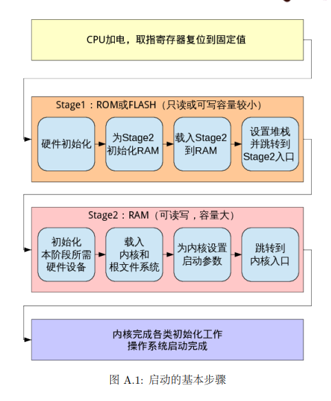
### 1.3 编译与链接（附录A）
##### 1.3.1 编译器的编译命令
```SHELL
gcc -E #编译器预处理
gcc -c #只编译不链接
```
##### 1.3.2 反汇编
- 反汇编（Disassembly）是将机器代码（二进制代码）转换回汇编代码的过程。这通常用于程序分析、调试、逆向工程等场景。
- 查看编译过程程序都进行了哪些操作？

##### 1.3.3 多个c文件的工程是如何编译成一个可执行文件的？
printf 的实现是在链接 (Link) 这一步骤中被插入到最终的可执行文件中的

### 1.4 一些遗忘语法

- extern
  >在C语言中，extern是一个关键字，用于声明一个变量或函数是在其他文件中定义的，而不是在当前文件中定义。它的主要作用是告诉编译器，这个符号（变量或函数）在链接时会在其他目标文件中找到，因此当前文件可以引用它，而不会出现未定义的错误。
- 指针的用法
    ```c
    int* num;
    num[i].element = (num+i)->element;
    ```


### 1.5 TLB
1. 正是由于程序的“局部性原理”（时间局部性和空间局部性），使得程序在短时间内倾向于访问相邻的内存地址，因此 TLB 的命中率通常非常高（如 99%以上），从而极大地提升了地址转换的效率。
2. 速度极快：硬件实现，完全用硬件逻辑管理，查找速度堪比 CPU 寄存器。
3. 容量很小：由于制造成本和功耗，TLB 的条目数非常有限，通常在几十到几千条之间。相比之下，整个页表可能有成千上万个条目。

### 1.6【变量声明与宏定义对比】

| 特性 | 变量声明 | 宏定义 |
|------|----------|--------|
| **处理阶段** | 编译时处理 | 预处理时处理 |
| **内存分配** | 运行时分配实际内存 | 不分配内存，只是文本替换 |
| **类型检查** | 有严格的类型检查 | 无类型检查 |
| **作用域** | 遵循作用域规则（局部、全局） | 从定义处到文件结尾，无视作用域 |
| **调试支持** | 可以在调试器中查看和修改变量值 | 调试时只能看到替换后的值，看不到宏名 |
| **语法** | `int x = 10;`<br>`const float PI = 3.14;` | `#define MAX 100`<br>`#define SQUARE(x) ((x)*(x))` |
| **生命周期** | 有明确的生命周期（自动、静态等） | 无生命周期概念 |
| **性能** | 需要内存访问 | 直接文本替换，通常更快 |
| **错误检查** | 编译时进行类型和语法检查 | 预处理阶段不检查错误，可能产生意外替换 |
| **使用场景** | 存储会在运行时改变的数据 | 定义常量、简单函数宏、条件编译 |
| **示例** | ```c<br>int count = 5;<br>count = count + 1;<br>``` | ```c<br>#define COUNT 5<br>// 使用 COUNT 的地方会被替换为 5<br>``` |
| **预处理后** | 保持不变 | 被替换为对应的文本 |
| **安全性** | 类型安全，编译器会检查 | 不安全，可能产生副作用<br>`SQUARE(x++)` 会展开为 `((x++)*(x++))` |

### 1.7 find命令的一些常见使用方法
```bash
find dir -name something -type d # d表示目录
find dir -name "*.c" # 符号*是通配符
```
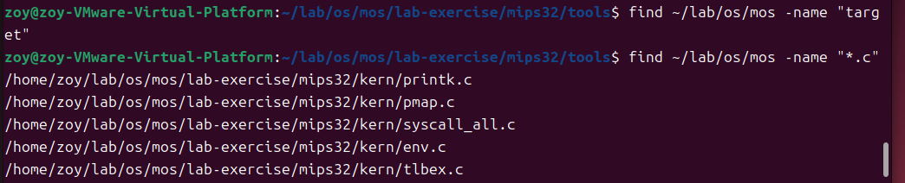


### 1.8 汇编指令复习
##### 1.8.1 `j` 与 `jal` 指令详细对比

| 特性 | `j` (Jump) | `jal` (Jump and Link) |
| :--- | :--- | :--- |
| **全称** | Jump | Jump and Link |
| **主要功能** | 无条件跳转 | 跳转并链接 |
| **行为** | 直接修改程序计数器(PC)到目标地址 | 1. 将 **返回地址** (PC+4) 存入 **`$ra`** 寄存器<br>2. 修改程序计数器(PC)到目标地址 |
| **关键区别** | 不保存返回地址 | **自动保存返回地址** |
| **主要用途** | 循环、条件分支后的跳转、无限循环、大的代码段跳转 | **函数/过程调用** |
| **返回方式** | 如果需要返回，必须手动记录位置 | 通常使用 **`jr $ra`** 指令返回到调用处 |
| **类比** | **`goto`** (在C语言中) | **函数调用** (如 `myFunction();`) |
##### 1.8.2 赋值指令
| 指令 | 类型 | 功能 | 类比C语言 |
| :--- | :--- | :--- | :--- |
| `la $rd, label` | 伪指令 | 加载地址到寄存器 | `ptr = &variable;` |
| `li $rd, imm` | 伪指令 | 加载常数到寄存器 | `a = 100;` |
| `lw $rd, off($rs)` | 核心指令 | 从内存加载数据到寄存器 | `a = *ptr;` |
| `sw $rt, off($rs)` | 核心指令 | 将寄存器数据存储到内存 | `*ptr = a;` |
| `move $rd, $rs` | 伪指令 | 复制寄存器的值 | `a = b;` |
# Part 2 实验思考&实验细节

### 2.1 【thinking1.1】
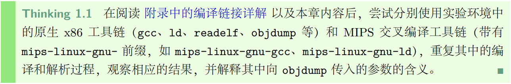
##### 2.1.1 gcc部分命令
gcc：GNU编译器集合（GNU Compiler Collection）中的C编译器。它能够将C、C++等语言的源代码编译成目标代码（机器代码）。在x86工具链中，gcc通常被配置为生成x86架构的可执行文件。
```bash
# __Linux 大小写敏感__
-- help #查看gcc相关文档，后续不再赘述
- E #Preprocess only; do not compile, assemble or link.
- S #Compile only; do not assemble or link.
- c #Compile and assemble, but do not link.
- o # 使用方法：gcc helloworld.c -o helloword，将helloworld.c文件，生成名为helloworld的可执行文件
```

输入文件
```bash
gcc - E Helloworld.c
```
预处理结果：文件变得很长，引入了非常多的头文件和变量声明（随意截取了一些内容），事实上我并不理解这些数字是什么意思。
> 经过查阅后，数字为"行标记"（Line Markers），它们是由预处理器生成的，用于告诉编译器在预处理之后代码的原始位置。格式通常为：
< lineno> "< filename>" [flags]
其中：
<lineno> 表示以下行在原始文件中的行号。
"< filename>" 表示原始文件名。
可选的[flags]可以是1、2、3、4，它们的含义如下：
1：表示新文件的开始（在包含头文件时会出现）。
2：表示返回一个文件（在包含头文件结束后，回到原文件）。
3：表示接下来的代码来自系统头文件，所以某些警告应该被抑制。
4：表示接下来的代码应该被当作包含在隐式的extern "C"块中（C++中）。


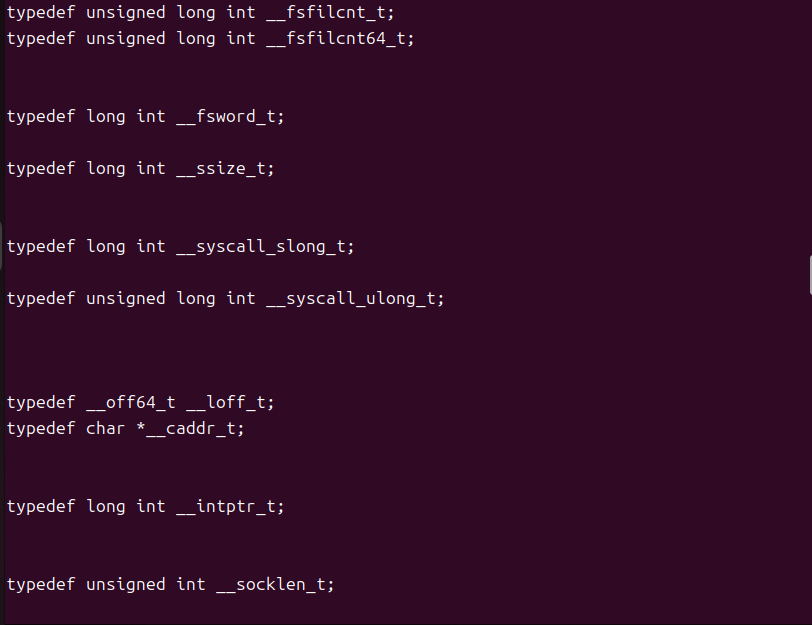
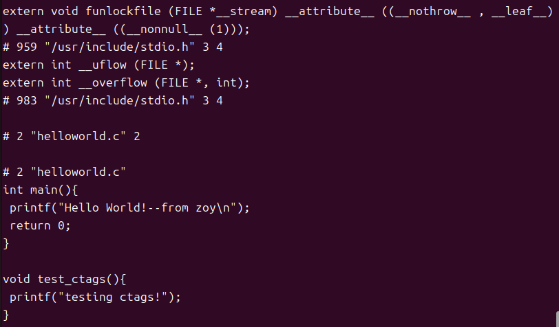

【问题（解释见1.6）】：上图类似 extern int \_\_uflow(FILE *)是声明还是宏定义?


```bash
gcc -S helloworld.c    
```
编译结果：生成了helloworld.s文件，是 __汇编语言代码__，并且也看不懂（其实仔细看能看明白一点点），但是和 -E 生成的文件不同，做一些示例截取。
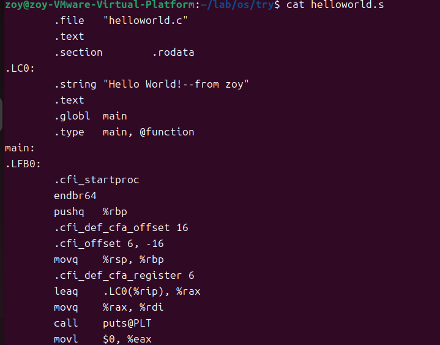

---
``` bash
gcc -c hellowold.c
```            
生成了helloworld.o文件，完全是看不懂的乱码，是 __编译后的机器代码__。
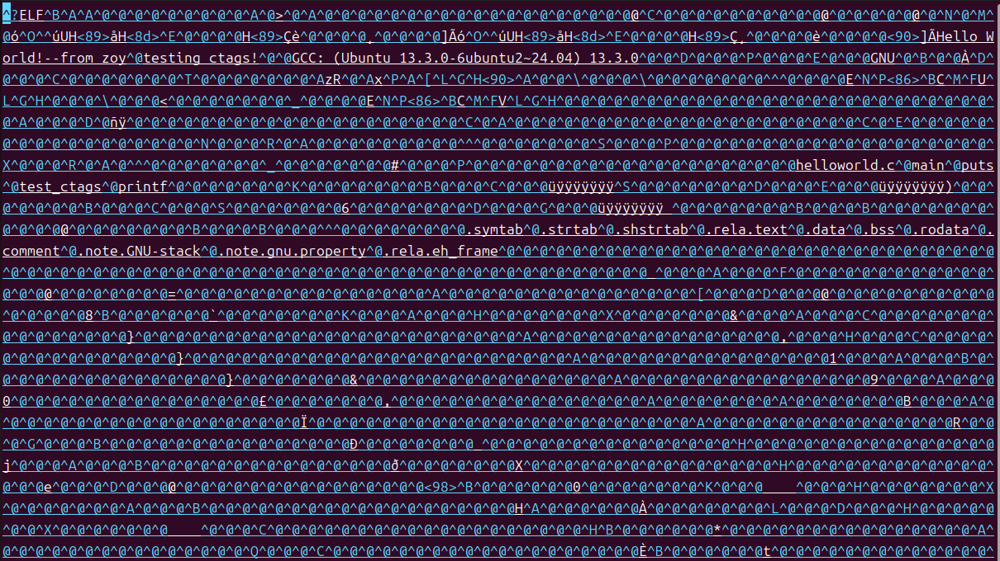

##### 2.1.2 ld部分命令
ld：GNU链接器（GNU linker）。它将 __一个或多个目标文件（.o文件）和库文件__ 链接在一起，生成可执行文件或共享库。ld处理目标文件的符号解析、重定位等步骤。
```bash
# 用ld --help 看晕了，所以问deepseek要了一些常用命令
--o <输出文件>：指定输出文件名。
-l <库名>：链接库文件，例如-lm链接数学库。
-L <目录>：添加库文件搜索路径。
-e <入口点>：设置程序的入口点。
-T <脚本文件>：指定链接脚本。
-shared ：生成共享库（动态库）。
-static ：静态链接库。
-r ：生成可重定位的输出（部分链接）。
-Map <映射文件>：生成链接映射文件。
--start-group 和--end-group：解决库之间的循环依赖
```


##### 2.1.3 readelf 部分命令
readelf：用于显示ELF（Executable and Linkable Format）格式文件的信息。ELF是Unix-like系统上常见的二进制文件格式（可执行文件、目标文件、共享库等）。readelf可以显示ELF文件的头部、节区（sections）、段（segments）、符号表等详细信息。
__其中ELF文件包括：目标文件（.o）、可执行文件和 共享对象文件__。
```bash
readelf -h 文件 #查看文件的header，注意不能是目录
readelf --help  #查看readelf相关命令
```
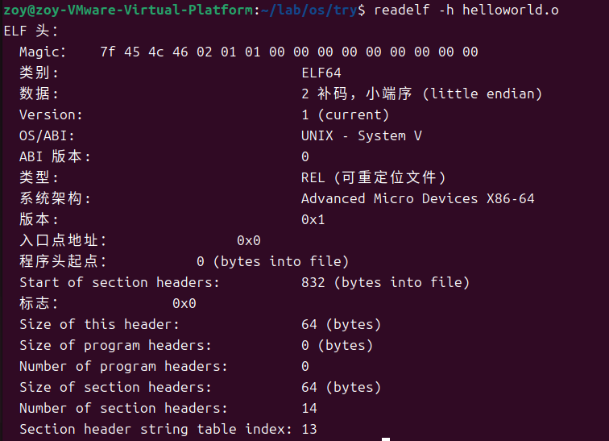


##### 2.1.4 objdump部分命令
objdump：用于显示二进制文件的信息。它可以反汇编可执行文件、显示目标文件的节区内容、符号表等。objdump也可以用来查看文件的结构和反汇编代码。
```bash
objdump -o helloworld.o
```


##### 2.1.5 mips交叉编译工具链
MIPS 交叉编译工具链是一套在一种架构（如 x86）上编译生成 MIPS 架构可执行代码的工具集合。下图为相关参数
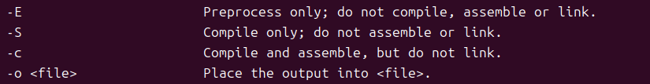
安装步骤
```bash
sudo apt update
sudo apt install gcc-mips-linux-gnu
```

使用以下命令
```bash
mips-linux-gnu-gcc helloworld.c
gcc  helloworld.c -o h
```
出现了 a.out 文件，a.out文件又是一堆乱码，变成绿色了，直接是可执行文件。
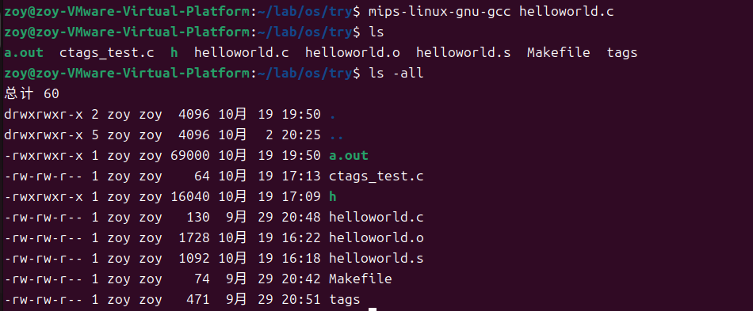
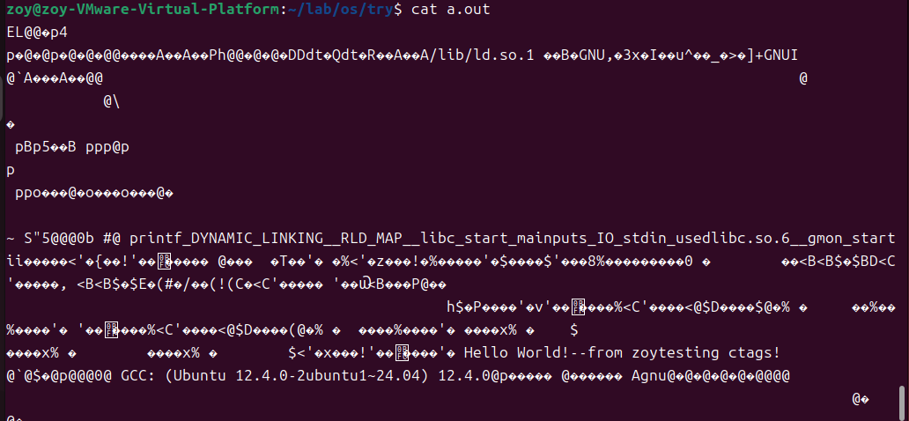
按照道理说，a.out和h是同样从helloworld.c 到编译链接的，但是反编译的时候， __objdump不认识a.out文件的结构__。

<mark>
有时间的话，可以继续深入了解一下。把mips-linux-gnu-gcc 预处理、编译、链接得到的可执行文件反编译，并和h反编译之后的file1.txt文件作比较。</mark>

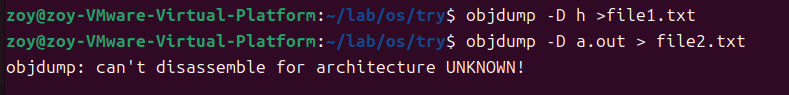

###   2.2【thinking1.2】& Makefile的解读和使用
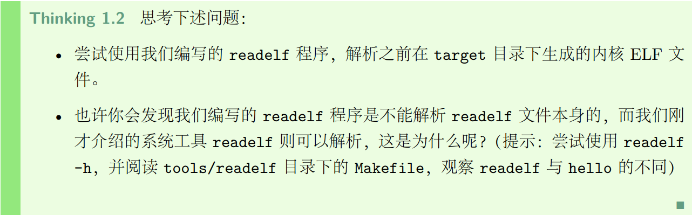
##### 2.2.1 【曾经的问题】采用了下面各种方法找不到target目录，所以这个thinking先pass。
【现在的回答】target目录是执行make命令后生成的。如执行根目录的Makefile文件时，for循环会递归到各个子目录下执行子目录下的Makefile命令（前提是Makefile文件里写了，如下图的make clean）。
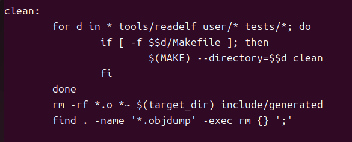
```bash
# 第一种方式（全局）
make clean
make 
make run

# 第二种方式（各个lab单独运行）
make clean
make test lab=x_y(x_y序列号tree之后查找，有的才能用，没有的会报错，导致无法生成target文件)
make run
```
##### 2.2.2 一些实验细节
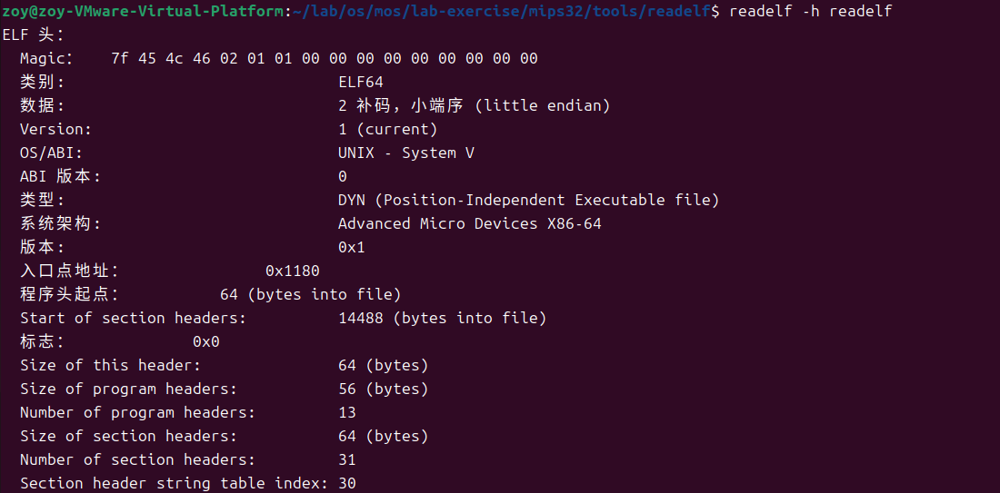
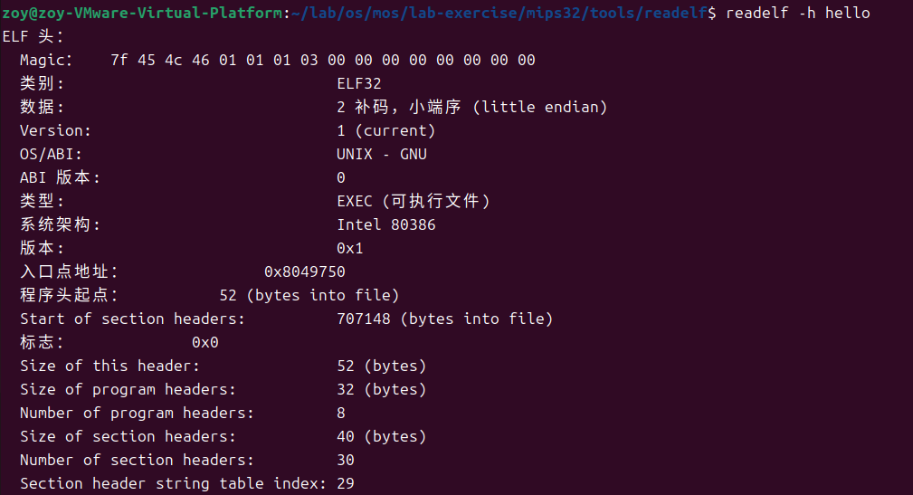

可以看出readelf是DYN文件
>1. 什么是PIE？
PIE（Position-Independent Executable）是一种特殊类型的可执行文件，其代码和数据的地址在加载时随机化。这意味着每次运行程序时，它都会被加载到内存中的不同地址。这种技术是ASLR（地址空间布局随机化）的一部分，旨在增加攻击者利用内存损坏漏洞的难度。
>2. PIE如何工作？
PIE使用位置无关代码（PIC）技术，这与构建共享库时使用的技术相同。PIC代码使用相对寻址而不是绝对地址，因此它可以被加载到内存中的任何地址而无需修改。

##### 2.2.3 ELF 是如何被载入到内存中并且被执行的？
重新注解：最终载入内存的内核是ELF格式的，它是如何载入内存并被执行的？
这个问题和2.4部分的thinking1.3的问题有重合之处，具体答案均见part4的全过程梳理。
### 2.3【exercise1.2】
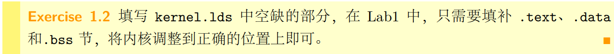
kernel.lds是linker script文件，指导链接器如何将各个段（section）组合到最终的可执行文件中，并设置正确的内存布局，**（内存布局要参考mips的内存分布，即include/mmu.h文件）**。
具体如下。
```c
//指定输出文件的架构为MIPS 
OUTPUT_ARCH(mips)
//指定程序的入口点是_start符号 
ENTRY(_start)

SECTIONS {
	. = 0x80000000;
	.tlb_miss_entry : {
		*(.text.tlb_miss_entry)
	}
	. = 0x80000180;
	.exc_gen_entry : {
		*(.text.exc_gen_entry)
	}
    
    //
	. = 0x80020000;
	.text : {
		*(.text)
	}
	.data : {
		*(.data)
	}
	bss_start = .;
	.bss  : {
		*(.bss)
	}
	bss_end = .;
	. = 0x80400000;
	end = . ;
}
```
### 2.3【thinking1.3】

内核入口被正确跳转，主要是bootloader知道内核入口在哪，这样子灵活性更高，比如电脑双系统。**具体启动过程见part4的全过程梳理。**


### 2.4 【exercise1.3&1.4】

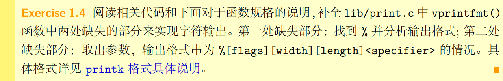
首先总结一些这两个练习，需要完成init/start.S和lib/print.c的部分，再进行一系列的make命令。make run的时候可能产生一系列的问题，比如陷入死循环、无输出等，给以下命令来杀死进程。
```bash
pkill -f qemu-system-mipsel
```
##### 2.4.1 【exercise 1.3】
```c

#include <asm/asm.h>
#include <mmu.h>

.text
EXPORT(_start) /* 声明 _start 为全局符号，链接器知道这是程序入口，和kernel.lds对应上 */
.set at
.set reorder
/* Lab 1 Key Code "enter-kernel" */
	/* clear .bss segment */
	la      v0, bss_start
	la      v1, bss_end

/* bss段的清理操作 */
clear_bss_loop: 
	beq     v0, v1, clear_bss_done
	sb      zero, 0(v0)
	addiu   v0, v0, 1
	j       clear_bss_loop
/* End of Key Code "enter-kernel" */

clear_bss_done:
	/* disable interrupts */
	mtc0    zero, CP0_STATUS
	/* set up the kernel stack */
	li      sp, KSTACKTOP
	/* jump to mips_init */
	j       mips_init
```
其中的KSTACKTOP变量定义在mmu.h文件中，# define KSTACKTOP (ULIM + PDMAP)。
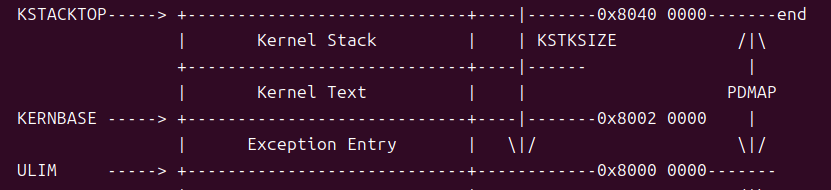
对汇编命令不太熟悉，见part1的1.8部分。

##### 2.4.1 【exercise 1.4】
print.c主要是处理格式问题。
<mark>具体的代码逻辑有空就补上。</mark>


#  Part 3 遗留问题 
### 3.1 链接&代码运行
路径：~/lab/os/try 部分有两个c语言代码，ctags_test.c 调用了helloworld.c 里的函数，但是ctags_test.c 目前无法运行？一输入gcc ctags_test.c -o c就报错
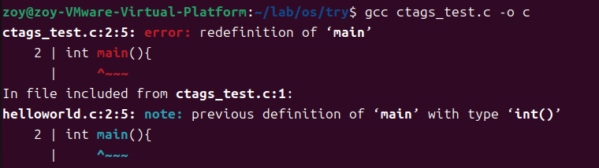
### 3.2 ELF文件的格式和参数
① 节头表的地址和节头表中的地址的关系（？）
② 偏移量的计算问题

### 3.3 exercise 1.2的地址选取问题
其实靠猜也能猜出来.text节的起始位置，但是为什么在内核镜像的起始虚拟地址呢？

> 【deepseek解释】：为了确保 __内核代码和数据在编译时确定的虚拟地址__ ，与 __运行时MMU（内存管理单元，memory manage unit）开启后映射到的虚拟地址__ 保持一致，从而让内核能够无缝地在虚拟内存空间中执行。

### 3.4 链接器是怎么通过ELF的位置信息，将多个目标文件进行连接的呢？

这个问题其实在guide-book中有说明，但为了加深记忆，用自己的话再来理解一遍。 
首先是文件从源代码到可执行文件的过程，如下图。

目标文件就是ELF格式的，经过链接器变成了可执行文件。以.o文件为例子，在使用readelf命令的时候，可以看到节的相关位置信息，而kernel.lds就会对文件的地址再调整成为最终执行的地址。

# Part 4 从cpu上电到载入内核的全过程梳理（mips架构）

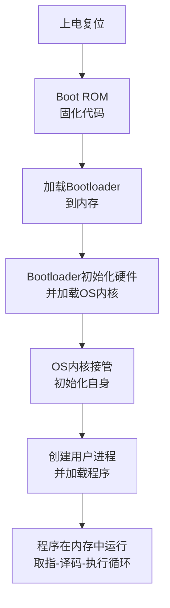

### 4.1-第一阶段：上电复位与 Boot ROM

当 CPU 通电或按下复位键后，硬件会强制程序计数器（PC）指向一个预设的、固定的物理地址。这个地址通常位于一块只读存储器（ROM）中，这块 ROM 就是 **Boot ROM**（或称为 BIOS、Firmware）。
> 操作系统内核的位置选取：
> 磁盘不能被CPU直接访问，而内存掉电易失，因此，内核有可能放置的位置只能是 CPU 能够直接访问的非易失性存储器——ROM 或 FLASH中。

1.  **固定入口地址**：在 MIPS 中，这个上电复位地址通常是 **0xBFC0 0000**（这是一个虚拟地址，在启动初期映射到固定的物理地址）。CPU 从这个地址取第一条指令。
2.  **Boot ROM 代码的作用**：
    *   **初级硬件初始化**：设置 CPU 的基本状态（如设置状态寄存器 `SR`，关闭中断等）。
    *   **内存控制器初始化**：检测和配置 SDRAM 控制器，因为后续所有复杂的操作都需要在速度更快的内存（RAM）中进行。
    *   **设置临时栈空间**：为 C 代码的运行准备一个小的栈区域。
    *   **加载 Bootloader**：从启动设备（如 FLASH、SD 卡、硬盘等）上将第二阶段的引导程序**Bootloader**加载到内存的指定位置。


### 4.2-第二阶段：Bootloader

Bootloader（如 U-Boot、PMON）是一段更复杂的程序，现在它已经从慢速的 ROM 中被拷贝到了快速的内存中执行。

1.  **更全面的硬件初始化**：
    *   初始化串口（UART），用于打印调试信息。
    *   初始化网络、USB 等外设。
    *   检测系统内存布局。
2.  **加载操作系统内核**：
    *   从存储设备上找到操作系统内核的镜像文件（如 Linux 的 `vmlinuz`）。
    *   将这个内核镜像读取到内存的某个特定地址。这个地址通常是由操作系统内核预先约定好的（例如 `0x8000 0000`）。
  

> 内核镜像：指的是包含完整操作系统内核代码、数据以及必要元数据的 __单个可执行文件__。它是由内核源代码经过编译、链接后生成的最终产物，是启动操作系统的核心载体。
3.  **为内核传递参数**：
    *   Bootloader 会准备一个叫做 **ATAGs** 或 **Device Tree Blob（DTB）** 的数据结构，里面包含了它探测到的硬件信息（如内存大小、时钟频率、启动参数等）。
    *   按照 MIPS 的 O32（或 N32）调用约定，将内核入口地址、DTB 地址等参数设置到指定的寄存器（如 `$a0`, `$a1`...）中。
4.  **跳转到内核**：
    *   Bootloader 执行一条 `jr` 指令，直接跳转到操作系统内核的入口地址，将控制权彻底移交。


### 4.3-第三阶段：操作系统内核

现在，CPU 开始执行内核的第一行代码。这个阶段通常由汇编代码开始，逐步过渡到 C 代码。

1.  **内核入口（汇编阶段）**：<mark>exercise1.3部分</mark>
    *   **设置运行时环境**：初始化内核的栈指针（`$sp`），设置全局指针（`$gp`）。
    *   **建立初级地址映射**：在启动初期，MMU（内存管理单元）可能尚未开启，或者处于一个简单的固定映射状态。内核需要设置一个初步的页表，将内核的虚拟地址（如 `0x8000 0000` 到 `0x9FFF FFFF`）映射到它们所在的物理地址上。
    *   **清零 BSS 段**：BSS 段用于存放未初始化的全局变量。内核代码会将该区域的内存全部清零。
    *   **跳转到 C 代码**：完成最基本的汇编设置后，调用内核的 C 入口函数，通常是 `start_kernel()`（在 Linux 中）。

2.  **内核主函数（C 阶段）**：
    *   **内存管理初始化**：探测物理内存，建立完整的内存管理模型（如 Buddy System），初始化 Slab 分配器。
    *   **进程管理初始化**：初始化任务调度器，创建第一个内核线程（idle 进程）。
    *   **设备驱动初始化**：解析 Bootloader 传递过来的设备树（DTB），识别硬件，并加载相应的驱动程序。
    *   **文件系统初始化**：初始化虚拟文件系统（VFS），挂载根文件系统。
    *   **启动第一个用户进程**：内核在最后，通常会从根文件系统中加载并执行一个用户空间的初始化程序（如 `/sbin/init` 或 `systemd`）。

### 4.4-第四阶段：用户程序的加载与运行

现在，操作系统已经完全跑起来了。当 Shell 输入一个命令（如 `./my_program`）来执行你的程序时，过程如下：

1.  **Shell 调用 `fork()` + `exec()`**：
    *   `fork()` 创建一个新的进程。
    *   `exec()` 系统调用负责将新的程序加载到当前进程的地址空间中，替换掉原有内容。

2.  **加载器的工作**：
    *   操作系统中的加载器（Loader）会打开可执行文件（如 ELF 格式），并解析其文件头。
    *   **分配内存**：根据 ELF 程序头（Program Header）的信息，为程序的各个段（如代码段 `.text`，数据段 `.data`）在用户空间分配虚拟内存页。
    *   **加载段内容**：将代码段、数据段的内容从磁盘文件读取到刚刚分配的内存页中。
    *   **动态链接**：如果程序使用了共享库（如 `libc.so`），加载器会调用动态链接器，将所需的共享库也加载到内存，并完成符号的重定位。
    *   **设置栈和堆**：为用户进程设置好初始的栈和堆空间。
    *   **设置 argc, argv, envp**：将命令行参数和环境变量压入用户栈。

3.  **程序开始执行**：
    *   加载器将进程的 PC 设置为程序的入口地址（通常是 `_start`，这个地址由链接器指定，例如 `0x00400000` 是 MIPS O32 ABI 常用的入口点）。
    *   调度器选择这个进程运行。
    *   CPU 开始从新的 PC 地址取指，你的程序正式在内存中运行！


### 4.5-第五阶段：程序在内存中的运行（取指-译码-执行循环）

这是 CPU 最微观的工作过程，对于你的程序 `my_program` 中的每一条指令：

1.  **取指**：CPU 将 PC 中的地址发送给 MMU。MMU 将其翻译成物理地址，然后从内存（Cache 或主存）中读取该地址处的指令（4字节），放入指令寄存器（IR）中，然后 PC 自增 4（指向下一条指令）。
2.  **译码**：CPU 控制单元解析这条指令。例如，识别出这是一条 `lw $t0, 0($s0)`（从内存加载字到寄存器）指令。
3.  **执行**：
    *   **计算地址**：将寄存器 `$s0` 的值与立即数 0 相加，得到有效地址。
    *   **内存访问**：将这个有效地址发送给 MMU，翻译成物理地址，然后从数据 Cache 或主存中读取数据。
    *   **写回**：将读取到的数据写回到目标寄存器 `$t0` 中。
4.  **循环**：PC 指向下一条指令，重复步骤 1。


