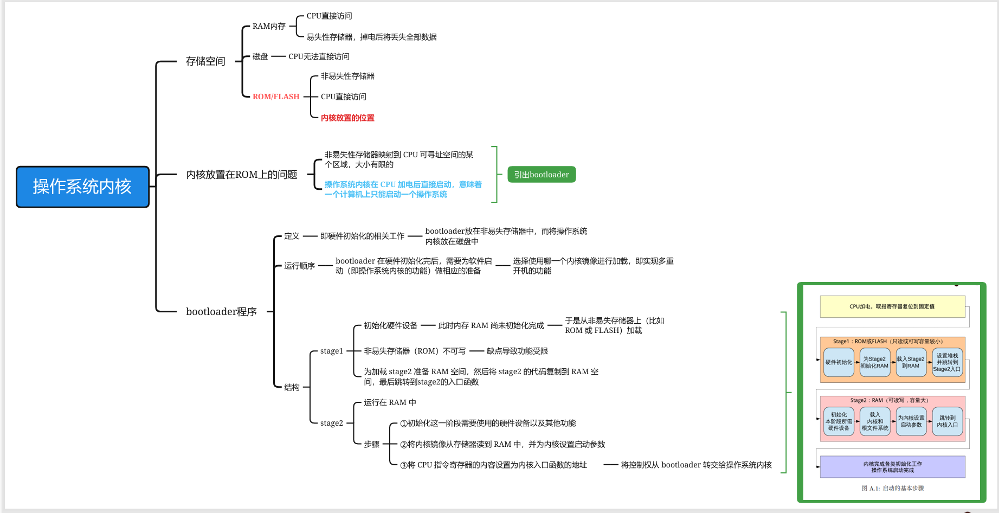
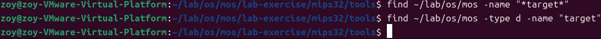
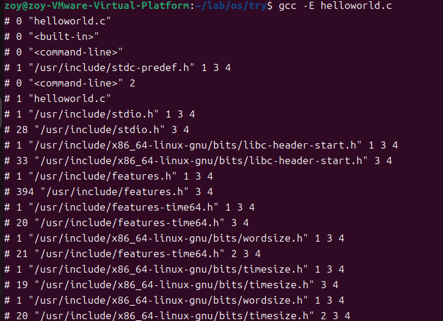
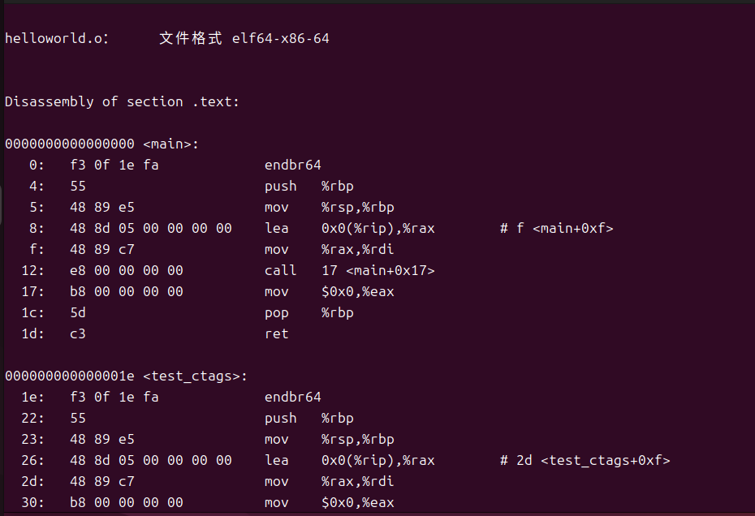
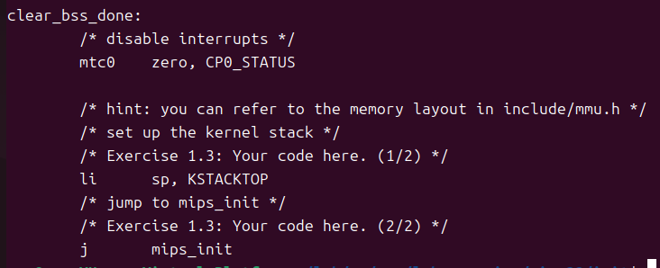

# lab1
###### 实验环境：虚拟机 Ubuntu 24.04.3 LTS
###### 持续时间：2025/10/18-2025/10/26
###### 笔记关键词：qemu仿真的串口硬件

###### 未做的标注： <mark>高亮</mark> 

###### 寄语：操作系统的学习，有些内容是隐藏在硬件原理中的。所以也要关注一下。对于咱们的实验来说，主要就是MIPS CPU的一些指令集和异常处理逻辑，以及中断和外设的处理逻辑。操作系统就是要配合这些硬件逻辑，找几个抽象的概念封装起来，让纯软件开发不需要关心那么多细节。


### Part 1 一些基础知识的查漏补缺
#### 1.1shell 脚本相关（附录A）
```shell
[ $a -ne 2]判断a是否等于2
-ne # not equal
数值比较运算符: -eq -lt -le -gt -ge 
字符串比较运算符：= !=
```
#### 1.2 操作系统内核（附录A）


#### 1.3 编译与链接（附录A）
##### 1.3.1 编译器的编译命令
```SHELL
gcc -E #编译器预处理
gcc -c #只编译不链接
```
##### 1.3.2 反汇编
- 反汇编（Disassembly）是将机器代码（二进制代码）转换回汇编代码的过程。这通常用于程序分析、调试、逆向工程等场景。
- 查看编译过程程序都进行了哪些操作？

##### 1.3.3 多个c文件的工程是如何编译成一个可执行文件的？
printf 的实现是在链接 (Link) 这一步骤中被插入到最终的可执行文件中的

#### 1.4 一些遗忘语法

- extern
  >在C语言中，extern是一个关键字，用于声明一个变量或函数是在其他文件中定义的，而不是在当前文件中定义。它的主要作用是告诉编译器，这个符号（变量或函数）在链接时会在其他目标文件中找到，因此当前文件可以引用它，而不会出现未定义的错误。
- 指针的用法
    ```c
    int* num;
    num[i].element = (num+i)->element;
    ```


#### 1.5 TLB
1. 正是由于程序的“局部性原理”（时间局部性和空间局部性），使得程序在短时间内倾向于访问相邻的内存地址，因此 TLB 的命中率通常非常高（如 99%以上），从而极大地提升了地址转换的效率。
2. 速度极快：硬件实现，完全用硬件逻辑管理，查找速度堪比 CPU 寄存器。
3. 容量很小：由于制造成本和功耗，TLB 的条目数非常有限，通常在几十到几千条之间。相比之下，整个页表可能有成千上万个条目。

#### 1.6【变量声明与宏定义对比】

| 特性 | 变量声明 | 宏定义 |
|------|----------|--------|
| **处理阶段** | 编译时处理 | 预处理时处理 |
| **内存分配** | 运行时分配实际内存 | 不分配内存，只是文本替换 |
| **类型检查** | 有严格的类型检查 | 无类型检查 |
| **作用域** | 遵循作用域规则（局部、全局） | 从定义处到文件结尾，无视作用域 |
| **调试支持** | 可以在调试器中查看和修改变量值 | 调试时只能看到替换后的值，看不到宏名 |
| **语法** | `int x = 10;`<br>`const float PI = 3.14;` | `#define MAX 100`<br>`#define SQUARE(x) ((x)*(x))` |
| **生命周期** | 有明确的生命周期（自动、静态等） | 无生命周期概念 |
| **性能** | 需要内存访问 | 直接文本替换，通常更快 |
| **错误检查** | 编译时进行类型和语法检查 | 预处理阶段不检查错误，可能产生意外替换 |
| **使用场景** | 存储会在运行时改变的数据 | 定义常量、简单函数宏、条件编译 |
| **示例** | ```c<br>int count = 5;<br>count = count + 1;<br>``` | ```c<br>#define COUNT 5<br>// 使用 COUNT 的地方会被替换为 5<br>``` |
| **预处理后** | 保持不变 | 被替换为对应的文本 |
| **安全性** | 类型安全，编译器会检查 | 不安全，可能产生副作用<br>`SQUARE(x++)` 会展开为 `((x++)*(x++))` |

#### 1.7 find命令的一些使用方法
```bash
find dir -name something -type d # d表示目录
find dir -name "*.c" # 符号*是通配符
```



#### 1.8 汇编指令复习
##### 1.8.1 `j` 与 `jal` 指令详细对比

| 特性 | `j` (Jump) | `jal` (Jump and Link) |
| :--- | :--- | :--- |
| **全称** | Jump | Jump and Link |
| **主要功能** | 无条件跳转 | 跳转并链接 |
| **行为** | 直接修改程序计数器(PC)到目标地址 | 1. 将 **返回地址** (PC+4) 存入 **`$ra`** 寄存器<br>2. 修改程序计数器(PC)到目标地址 |
| **关键区别** | 不保存返回地址 | **自动保存返回地址** |
| **主要用途** | 循环、条件分支后的跳转、无限循环、大的代码段跳转 | **函数/过程调用** |
| **返回方式** | 如果需要返回，必须手动记录位置 | 通常使用 **`jr $ra`** 指令返回到调用处 |
| **类比** | **`goto`** (在C语言中) | **函数调用** (如 `myFunction();`) |
##### 1.8.2 赋值指令
| 指令 | 类型 | 功能 | 类比C语言 |
| :--- | :--- | :--- | :--- |
| `la $rd, label` | 伪指令 | 加载地址到寄存器 | `ptr = &variable;` |
| `li $rd, imm` | 伪指令 | 加载常数到寄存器 | `a = 100;` |
| `lw $rd, off($rs)` | 核心指令 | 从内存加载数据到寄存器 | `a = *ptr;` |
| `sw $rt, off($rs)` | 核心指令 | 将寄存器数据存储到内存 | `*ptr = a;` |
| `move $rd, $rs` | 伪指令 | 复制寄存器的值 | `a = b;` |
### Part 2 实验思考&实验细节
#### 2.1 【thinking1.1】

##### 2.1.0 C语言从预处理到运行的过程

##### 2.1.1 gcc部分命令
gcc：GNU编译器集合（GNU Compiler Collection）中的C编译器。它能够将C、C++等语言的源代码编译成目标代码（机器代码）。在x86工具链中，gcc通常被配置为生成x86架构的可执行文件。
```bash
# __Linux 大小写敏感__
-- help #查看gcc相关文档，后续不再赘述
- E #Preprocess only; do not compile, assemble or link.
- S #Compile only; do not assemble or link.
- c #Compile and assemble, but do not link.
- o # 使用方法：gcc helloworld.c -o helloword，将helloworld.c文件，生成名为helloworld的可执行文件
```

输入文件
```bash
gcc - E Helloworld.c
```
预处理结果：文件变得很长，引入了非常多的头文件和变量声明（随意截取了一些内容），事实上我并不理解这些数字是什么意思。
> 经过查阅后，数字为"行标记"（Line Markers），它们是由预处理器生成的，用于告诉编译器在预处理之后代码的原始位置。格式通常为：
< lineno> "< filename>" [flags]
其中：
<lineno> 表示以下行在原始文件中的行号。
"< filename>" 表示原始文件名。
可选的[flags]可以是1、2、3、4，它们的含义如下：
1：表示新文件的开始（在包含头文件时会出现）。
2：表示返回一个文件（在包含头文件结束后，回到原文件）。
3：表示接下来的代码来自系统头文件，所以某些警告应该被抑制。
4：表示接下来的代码应该被当作包含在隐式的extern "C"块中（C++中）。




【问题（解释见1.6）】：上图类似 extern int \_\_uflow(FILE *)是声明还是宏定义?


---
```bash
gcc -S helloworld.c    
```
编译结果：生成了helloworld.s文件，是 __汇编语言代码__，并且也看不懂（其实仔细看能看明白一点点），但是和 -E 生成的文件不同，做一些示例截取。


---
``` bash
gcc -c hellowold.c
```            
生成了helloworld.o文件，完全是看不懂的乱码，是 __编译后的机器代码__。


##### 2.1.2 ld部分命令
ld：GNU链接器（GNU linker）。它将 __一个或多个目标文件（.o文件）和库文件__ 链接在一起，生成可执行文件或共享库。ld处理目标文件的符号解析、重定位等步骤。
```bash
# 用ld --help 看晕了，所以问deepseek要了一些常用命令
--o <输出文件>：指定输出文件名。
-l <库名>：链接库文件，例如-lm链接数学库。
-L <目录>：添加库文件搜索路径。
-e <入口点>：设置程序的入口点。
-T <脚本文件>：指定链接脚本。
-shared ：生成共享库（动态库）。
-static ：静态链接库。
-r ：生成可重定位的输出（部分链接）。
-Map <映射文件>：生成链接映射文件。
--start-group 和--end-group：解决库之间的循环依赖
```
<mark>有点难做，暂时不做。</mark>
##### 2.1.3 readelf 部分命令
readelf：用于显示ELF（Executable and Linkable Format）格式文件的信息。ELF是Unix-like系统上常见的二进制文件格式（可执行文件、目标文件、共享库等）。readelf可以显示ELF文件的头部、节区（sections）、段（segments）、符号表等详细信息。
__其中ELF文件包括：目标文件（.o）、可执行文件和 共享对象文件__
```bash
-h #查看header
```


##### 2.1.4 objdump部分命令
objdump：用于显示二进制文件的信息。它可以反汇编可执行文件、显示目标文件的节区内容、符号表等。objdump也可以用来查看文件的结构和反汇编代码。
```bash
objdump -o helloworld.o
```


##### 2.1.5 mips交叉编译工具链
MIPS 交叉编译工具链是一套在一种架构（如 x86）上编译生成 MIPS 架构可执行代码的工具集合。下图为相关参数

安装步骤
```bash
sudo apt update
sudo apt install gcc-mips-linux-gnu
```

使用以下命令
```bash
mips-linux-gnu-gcc helloworld.c
gcc  helloworld.c -o h
```
出现了 a.out 文件，a.out文件又是一堆乱码，变成绿色了，直接是可执行文件。


按照道理说，a.out和h是同样从helloworld.c 到编译链接的，但是反编译的时候， __objdump不认识a.out文件的结构__。

<mark>
有时间的话，可以继续深入了解一下。把mips-linux-gnu-gcc 预处理、编译、链接得到的可执行文件反编译，并和h反编译之后的file1.txt文件作比较。</mark>


####   2.2【thinking1.2】& Makefile的解读和使用

【曾经的问题】采用了下面各种方法找不到target目录，所以这个thinking先pass。
【现在的回答】target目录是执行make命令后生成的。如执行根目录的Makefile文件时，for循环会递归到各个子目录下执行子目录下的Makefile命令（前提是Makefile文件里写了，如下图的make clean）。

```bash
# 第一种方式（全局）
make clean
make 
make run

# 第二种方式（各个lab单独运行）
make clean
make test lab=x_y(x_y序列号tree之后查找，有的才能用，没有的会报错，导致无法生成target文件)
make run
```

#### 2.3【thinking1.3】


#### 2.4 【exercise 1.3&1.4】


首先总结一些这两个练习，需要完成init/start.S和lib/print.c的部分，再进行一系列的make命令。make run的时候可能产生一系列的问题，比如陷入死循环、无输出等，给以下命令来杀死进程。
```bash
pkill -f qemu-system-mipsel
```
##### 2.4.1 【exercise 1.3】
本来就对汇编命令不太熟悉，见part1的1.8部分。


##### 2.4.1 【exercise 1.4】
print.c就是处理格式问题。<mark>具体的代码逻辑稍后补上。</mark>


#### <mark> Part 3 遗留问题</mark>
##### 3.1 链接&代码运行
路径：~/lab/os/try 部分有两个c语言代码，ctags_test.c 调用了helloworld.c 里的函数，但是ctags_test.c 目前无法运行？一输入gcc ctags_test.c -o c就报错

##### 3.2 ELF文件的格式和参数
① 节头表的地址和节头表中的地址的关系（？）
② 偏移量的计算问题

##### 3.3 lab1.2的地址选取问题
其实靠猜也能猜出来location counter的位置，但是为什么定位计数器的位置在内核镜像的起始虚拟地址呢？

> 【deepseek解释】：为了确保 __内核代码和数据在编译时确定的虚拟地址__ ，与 __运行时MMU（内存管理单元，memory manage unit）开启后映射到的虚拟地址__ 保持一致，从而让内核能够无缝地在虚拟内存空间中执行。

