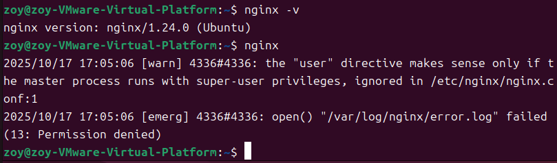
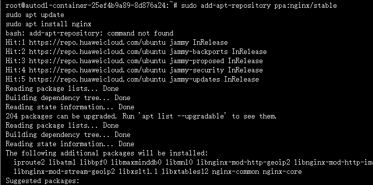

## 10.17笔记

###### 天气&心情：有点冷的一天，穿了风衣和衬衫，还好没下雨，风有点大
###### 关键词：seminar上论文的一些新名词&前端打包产物（？）
---

#### 1、seminar 
##### 1.1 Linux PCIe总线驱动
##### 1.2 NIC网卡
#### 2、vue项目打包
##### [参考文章](https://zhuanlan.zhihu.com/p/431796992)
##### 2.1 一些错误
- nginx拼写成ngnix
- 很奇怪在autodl上面租赁的服务器 输入 sudo apt install nginx就会显示无法定位，但是在自己的虚拟机上成功安装，不知道autodl上租的有什么问题。
##### 2.2 报错信息如下

##### 2.3 autodl上尝试
首先报错

之后尝试更新包，发现有很多源都有nginx

输入 sudo apt install nginx后完成安装，并且输入whereis nginx有反馈。
 
__尝试启动nginx__ ，成功
ssh -p 43855 root@connect.westb.seetacloud.com